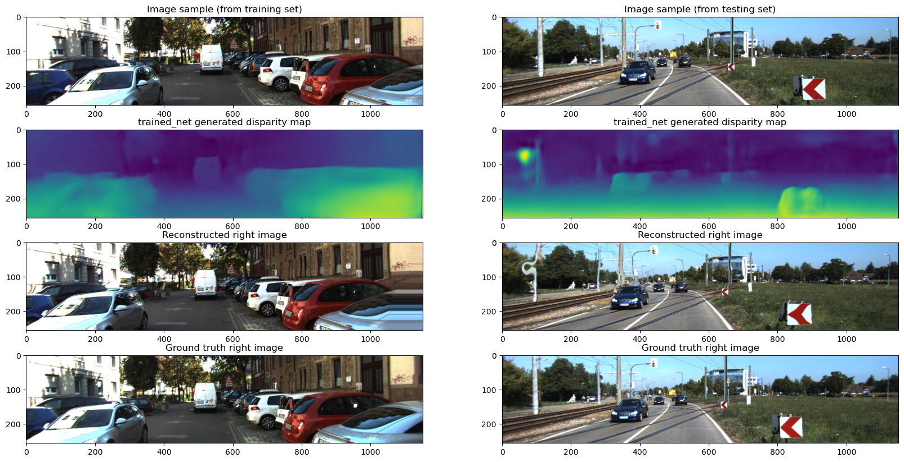

# Unsupervised Monocular Depth Estimation Neural Network

This project is creating a neural network to do monocular depth estimation on road images using an unsupervised training set, based off the [Godard et al., 2017](https://arxiv.org/pdf/1609.03677) paper. Since the work was done as a project for a class, the code is not available, but there is a summary of the project that describes the work done and the results [here]https://github.com/OliverTattersall/monoDepthEstim/blob/main/preview.ipynb.

An examples of the results of the network are below:

